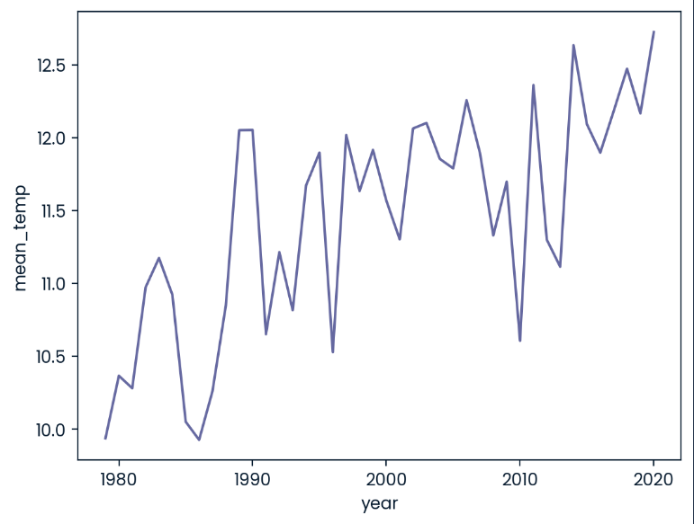
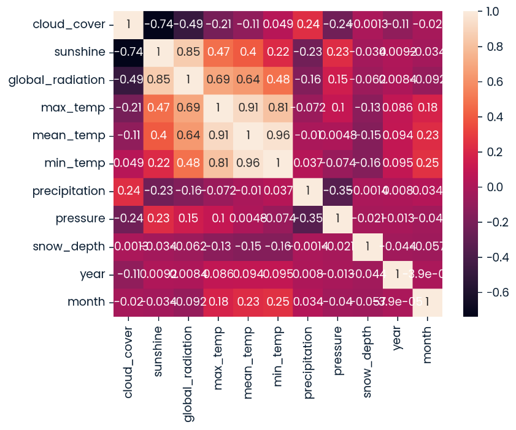

# London Weather Regression Pipeline

An end-to-end machine learning workflow for **predicting average monthly temperatures in London**, using **Linear Regression, Decision Tree, and Random Forest models**.  
This project demonstrates **data preprocessing, feature engineering, exploratory data analysis, model evaluation, and MLflow tracking** for reproducible experiments.

---

## Overview

Understanding weather patterns is crucial for urban planning, agriculture, and energy management.  
This project uses historical London weather data to predict **mean monthly temperatures** based on features like cloud cover, sunshine, precipitation, global radiation, and pressure.

The workflow includes:

- Data cleaning and preprocessing  
- Feature engineering and aggregation  
- Visualization of trends and correlations  
- Regression modeling with multiple algorithms  
- Performance evaluation using RMSE  
- Experiment tracking via MLflow

---

## Key Features

- **Exploratory Data Analysis (EDA)** – Understand trends, correlations, and patterns.  
- **Feature Engineering** – Extract year and month, aggregate weather metrics.  
- **Regression Models** – Linear Regression, Decision Tree, and Random Forest.  
- **Model Evaluation** – RMSE for performance comparison.  
- **MLflow Tracking** – Log parameters, metrics, and models for reproducibility.  
- **Visualization** – Line plots and heatmaps for insights.

---

## Models Used

| Model | Description |
|-------|-------------|
| Linear Regression | Baseline regression model for predicting mean temperature. |
| Decision Tree Regressor | Non-linear regression with max depth tuning. |
| Random Forest Regressor | Ensemble method improving accuracy and reducing overfitting. |

---

## Tech Stack

- **Python 3.10+**  
- **Pandas & NumPy** – Data handling and preprocessing  
- **Matplotlib & Seaborn** – Data visualization  
- **Scikit-learn** – Regression models, preprocessing, and metrics  
- **MLflow** – Experiment tracking and model logging  

---

## Installation & Setup

```bash
# Clone the repository
git clone https://github.com/yourusername/london-weather-regression.git
cd london-weather-regression

# Create a virtual environment
python -m venv venv
source venv/bin/activate     # Mac/Linux
venv\Scripts\activate        # Windows

# Install dependencies
pip install -r requirements.txt
# Run the main script
python main.py


```
## Sample Results

### Model Performnace(RMSE)
#### Linear Regression 
- Run: 0 | RMSE: 2.45
- Run: 1 | RMSE: 2.47
- Run: 2 | RMSE: 2.43

#### Decision Tree Regressor
- Run: 0 | Max Depth: 1 | RMSE: 2.78
- Run: 1 | Max Depth: 2 | RMSE: 2.32
- Run: 2 | Max Depth: 10 | RMSE: 1.87

#### Random Forest Regressor
- Run: 0 | Max Depth: 1 | RMSE: 2.11
- Run: 1 | Max Depth: 2 | RMSE: 1.78
- Run: 2 | Max Depth: 10 | RMSE: 1.45

### Explatory Data Analysis Examples
- Line plot of mean temperature over years and months.
- Heatmap showing correlations between weather features.
### Mean Temperature Trend Over Months


### Heatmap of Feature Correlations



### MLFlow Tracking
- Parameters logged: max_depth
- Metrics logged: rmse_lr, rmse_tr, rmse_fr
- Models logged: Linear Regression, Decision Tree, Random Forest
- Experiment results searchable via mlflow.search_runs()

## Insights & Learnings
- Ensemble methods (Random Forest) outperform single models for non-linear patterns.
- Data preprocessing and scaling are crucial for regression performance.
- Logging via MLflow ensures experiments are reproducible and results are comparable.
- Feature selection impacts both accuracy and interpretability of models.

## Future Work
- Test additional ensemble methods like Gradient Boosting or XGBoost.
- Hyperparameter tuning with GridSearchCV for optimal model selection.
- Incorporate seasonal and lag features to capture temporal dependencies.
- Deploy the best model as a REST API for real-time temperature predictions.


